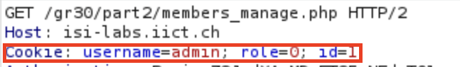

# Labo 3 - Web

## Partie 1 - Application mail 1
### Manipulation 4.2
> Tenter une escalation de privilèges. L’objectif est d’être réellement connecté en tant
que l’utilisateur « admin », avec son rôle (et privilèges), son login et son identifiant
(id) !
Il est important de ne pas compromettre l’utilisation de l’application, c’est-à-dire de
ne modifier aucune donnée

Il suffit simplement de modifier l'url en mettant l'id 1 qui correspond à l'utilisateur admin à la place de l'id 2 qui correspond à l'utilisateur test.

https://isi-labs.iict.ch/gr30/part1/member.php?id=1

### Question 4.1
#### a) 
> Quel type d’attaque est effectuée ici ?

Une tentative d'escalade de privilèges, visant à obtenir des privilèges d'administrateur sur l'application Web (détournement de session).

#### b)
> Quelle technique d’exploitation avez-vous utilisée ?

La technique d'exploitation utilisée est une faille dans l'application donnant accès aux autres comptes directement en manipulant l'url de HTTP.

#### c)
> Détailler la méthode utilisée pour se connecter en tant que « admin ».

Il suffit simplement de modifier l'url en mettant l'id 1 qui correspond à l'utilisateur admin à la place de l'id 2 qui correspond à l'utilisateur test.

https://isi-labs.iict.ch/gr30/part1/member.php?id=1

### Question 4.2
> Quelle est/sont la/les vulnérabilité(s) du top10 de l’OWASP (2021) présente(s) ici (et
qui permet(tent) de se connecter en tant qu’admin) ?

Plusieurs vulérabilités de ce site sont relatées dans le rapport.
Voici la liste :
- A01 2021 - Broken Access Control
- A04 2021 - Insecure Design
- A05 2021 - Security Misconfiguration
- A07 2021 - Identification and Authentication Failures

### Question 4.3
>Comment pourrait-on remédier à cette faille ? Justifiez

En ne spécifiant pas l'id d'un user directement dans l'URL.
Cela permettrait de ne pas pouvoir uniquement modifier l'URL afin de se connecter avec un autre compte.

## Partie 2 - Application mail 2
### Question 5.1
> Comment êtes-vous parvenu à vous connecter en tant qu’« admin » ?
> Montrez avec une capture d’écran que vous y êtes parvenu.

En modifiant le cookie de la session de l'utilisateur test dans la requête HTTP, il sera possible d'être connecté en tant qu'admin.

Les valeurs suivantes ont été remplacées par l'utilisateur admin, son role et son id.

Ensuite, nous pouvons voir que nous sommes connectés avec l'utilisateur admin.

### Question 5.2
> Quelle est/sont la/les vulnérabilité(s) du top10 de l’OWASP (2021) présente(s) ici (et
> qui permet(tent) de se connecter en tant qu’admin) ?

- A01 2021 - Broken Access Control
- A04 2021 - Insecure Design
- A05 2021 - Security Misconfiguration
- A07 2021 - Identification and Authentication Failures

### Question 5.3
> Comment remédier à cette faille ? Justifiez.

Que les informations du users et du role ne soit pas directement stokcé en clair dans le cookie.

