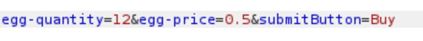

# Labo 3 - Web

## Partie 1 - Application mail 1
### Manipulation 4.2
> Tenter une escalation de privilèges. L’objectif est d’être réellement connecté en tant
que l’utilisateur « admin », avec son rôle (et privilèges), son login et son identifiant
(id) !
Il est important de ne pas compromettre l’utilisation de l’application, c’est-à-dire de
ne modifier aucune donnée

Il suffit simplement de modifier l'url en mettant l'id 1 qui correspond à l'utilisateur admin à la place de l'id 2 qui correspond à l'utilisateur test.

https://isi-labs.iict.ch/gr30/part1/member.php?id=1

### Question 4.1
#### a) 
> Quel type d’attaque est effectuée ici ?

Une tentative d'escalade de privilèges, visant à obtenir des privilèges d'administrateur sur l'application Web (détournement de session).

#### b)
> Quelle technique d’exploitation avez-vous utilisée ?

La technique d'exploitation utilisée est une faille dans l'application donnant accès aux autres comptes directement en manipulant l'url de HTTP.

#### c)
> Détailler la méthode utilisée pour se connecter en tant que « admin ».

Il suffit simplement de modifier l'url en mettant l'id 1 qui correspond à l'utilisateur admin à la place de l'id 2 qui correspond à l'utilisateur test.

https://isi-labs.iict.ch/gr30/part1/member.php?id=1

### Question 4.2
> Quelle est/sont la/les vulnérabilité(s) du top10 de l’OWASP (2021) présente(s) ici (et
qui permet(tent) de se connecter en tant qu’admin) ?

Plusieurs vulérabilités de ce site sont relatées dans le rapport.
Voici la liste :
- A01 2021 - Broken Access Control
- A04 2021 - Insecure Design
- A05 2021 - Security Misconfiguration
- A07 2021 - Identification and Authentication Failures

### Question 4.3
> Comment pourrait-on remédier à cette faille ? Justifiez

En ne spécifiant pas l'id d'un user directement dans l'URL.
Cela permettrait de ne pas pouvoir uniquement modifier l'URL afin de se connecter avec un autre compte.

## Partie 2 - Application mail 2
### Question 5.1
> Comment êtes-vous parvenu à vous connecter en tant qu’« admin » ?
> Montrez avec une capture d’écran que vous y êtes parvenu.

En modifiant le cookie de la session de l'utilisateur test dans la requête HTTP, il sera possible d'être connecté en tant qu'admin.

Les valeurs suivantes ont été remplacées par l'utilisateur admin, son role et son id.


Ensuite, nous pouvons voir que nous sommes connectés avec l'utilisateur admin.


### Question 5.2
> Quelle est/sont la/les vulnérabilité(s) du top10 de l’OWASP (2021) présente(s) ici (et
> qui permet(tent) de se connecter en tant qu’admin) ?

- A01 2021 - Broken Access Control
- A04 2021 - Insecure Design
- A05 2021 - Security Misconfiguration
- A07 2021 - Identification and Authentication Failures

### Question 5.3
> Comment remédier à cette faille ? Justifiez.

Que les informations du users et du role ne soit pas directement stokcé en clair dans le cookie.

## Partie 3 – Salaires
### Manipulation 6.2
> Afficher les salaires de tous les employés (en une seule fois).
> A nouveau, il est important de ne pas compromettre l’utilisation de l’application,
> c’est-à-dire de ne modifier aucune donnée.

Il suffit de mettre dans le champs Username : ' OR '1'='1, ce qui va nous donner que la condition sera toujours vrai donc tous les salaires seront affichés.


### Question 6.1
> Identifier la vulnérabilité exploitée (le top10 peut être utile).
> Expliquer la méthode d’exploitation utilisée pour afficher l’ensemble des salaires.

Nous avons utilisé l'injection SQL.
Dans le top 10 c'est A03 2021 - Injection.
Cette techique nous a permis d'afficher tous les salaires.

Il suffit de mettre dans le champs Username : ' OR '1'='1, ce qui va nous donner que la condition sera toujours vrai donc tous les salaires seront affichés.

### Manipulation 6.3
> Modifiez votre salaire (le doubler).
Il est important de ne pas compromettre l’utilisation de l’application, c’est-à-dire de
ne modifier aucune donnée (sauf celle demandée).


```
`; UPDATE Employees SET Salary = 174000 WHERE Name='TestLabo
```

### Question 6.2
> Identifier la vulnérabilité exploitée (le top10 peut être utile).
> Expliquer la méthode d’exploitation utilisée pour doubler votre salaire.

C'est également de l'injection SQL.
A03 2021 - Injection.

Il faut ajouter '; ainsi que la requête SQL permettant de mettre à jour le salaire :

```
`; UPDATE Employees SET Salary = 174000 WHERE Name='TestLabo
```

Grâce à cela, on pourra envoyer une requête SQL supplémentaire au serveur.

Ensuite, si on affiche le salaire de l'utilisateur TestLabo, on pourra voir qu'il a effectivement été doublé.


### Question 6.3
> Quelle est/sont la/les vulnérabilité(s) du top10 de l’OWASP (2021) présente(s) dans
cette application ?

- A01 2021 - Broken Access Control
- A03 2021 - Injection
- A04 2021 - Insecure Design
- A05 2021 - Security Misconfiguration

### Question 6.4
> Comment remédier à cette faille ?

Pour la partie écriture, nous pouvons limiter les droits de l'application sur la base de données.

## Partie 4 - Achat d’œufs
### Question 7.1
> Expliquer comment vous avez procédé pour exploiter ce service.

Dans la requête HTTP, il suffit de modifier le prix de l'oeuf à 0.50 centime par exemple afin qu'on puisse en acheter 12 avec 10 CHF.



### Question 7.2
> Proposer une manière de corriger la vulnérabilité que vous avez découverte.

En enlevant le prix de l'oeuf dans la requête HTTP, on pourra supprimer cette vulnérabilité.

## Partie 5 - CMSimple
### Question 8.1
> Que pouvez-vous remarquer dans l’encadré rouge sur la page principale ? Qu’est-ce
> que cela laisse penser ?

L'encadré rouge contient un avertissement demandant aux utilisateurs de changer immédiatement le mot de passe de connexion par défaut.

Cela laisse penser que le site a été mis à disposition sur internet avec le mot de passe de connexion par défaut, ce qui peut présenter un risque de sécurité.

### Manipulation 8.2
> Trouvez la page de login et entrer dans la zone d’administration afin de modifier le
> mot de passe, comme l’encadré rouge vous le demande.

Pour se connecter à la zone d'administration, il suffit d'entrer les crendetials par défaut du CMSimple.
Ensuite il sera possible de modifier le mot de passe.

### Question 8.2
> Quelle est/sont la/les vulnérabilité(s) du top10 de l’OWASP (2021) présente(s) dans
> cette application ?

- A05 2021 - Security Misconfiguration
- A07 2021 – Identification and Authentication Failures

### Question 8.3 
> Proposez 2 idées complémentaires ou alternatives pour corriger cette/ces vulnérabilité(s).

Obliger la modification du mot de passe lors de la première connexion.
Définir une complexité de mot de passe.

## Partie 6 - Path traversal
### Question 9.1
> Dans quel(s) dossier(s) sont stockés les drapeaux sur le serveur ?

Les drapeaux sont stockés dans un dossier à la source du serveur se nommant `/flags`, puis dans un sous-dossier correspondant au continent auquel le pays appartient, par exemple pour l'Albanie :

```
https://isi-labs.iict.ch/gr30/part6/flags/europa/
```

### Manipulation 9.2
> Accéder à la page secrète

Pour accéder à la page secret, on peut rajouter à la place du nom d'un continent ../, cela va nous afficher la hiérarchie des dossiers sur le site web, ensuite si on rajoute `../secret`, on pourra accéder à la page secrète.

```
https://isi-labs.iict.ch/gr30/part6/index.php?continent=../secret
```

Ce type d'attaque se nomme le Path traversal.

Source : https://wiki.owasp.org/index.php/Path_Traversal

### Question 9.2
> Que peut-on constater quand on change de continent ?

Lorsqu'on change de continent, on constate que le lien change et qu'on envoie le continent souhaité en paramètre à une page nommé index.php.

### Question 9.3
> Quelle est/sont la/les vulnérabilité(s) du top10 de l’OWASP (2017) présente(s) dans
> cette application ?

- A01 2021 – Broken Access Control
- A08 2021 – Software and Data Integrity Failures
  
### Question 9.4
> Qu’est-ce qui pourrait être fait pour corriger l’application et restreindre l’accès à la
> page secrète ?

Il faudrait ajouter un contrôle du paramètre entrée pour le continent, ce qui permettrait d'interdire l'accès à d'autres données autres que les drapeaux des pays.

## Partie 7 – XSS dans l’application de messagerie
### Manipulation 10.2
> Envoyer un message à l’utilisateur « test2 » avec l’objectif suivant :
> Lorsque l’utilisateur « test2 » ouvrira son message reçu, une fenêtre pop-up devra
> s’afficher. Pour l’exemple, afficher le texte « Your account has been hacked ! »
> Se connecter au compte test2 pour constater le résultat.

On peut injecter un script en JavaScript dans le body de l'email qui va lancer une pop-up dès que l'utilisateur ouvrira le message.

```
<script type="text/javascript">
  window.alert("Your account has been hacked !");
</script>
```


### Manipulation 10.3
> Envoyer un message à l’utilisateur « test2 » avec l’objectif suivant :
> Lorsque l’utilisateur « test2 » consultera sa messagerie, une fenêtre pop-up devra
> s’afficher. Pour l’exemple, afficher le texte « Your account has been hacked ! »
> Se connecter au compte test2 (test2/pass@test2) pour constater le résultat

Identique que pour la manipulation ci-dessus, sauf que la ligne sera insérée dans le sujet de l'email.

### Question 10.1
> Donnez 2 actions malveillantes qu’un attaquant pourrait commettre en exploitant
> cette vulnérabilité.

- Lancement du téléchargement d'un outil malveillant
- Phishing

### Question 10.2
> Comment s’appelle cette vulnérabilité ?

Cette vulnérabilité s'appelle Cross-site scripting, car l'attaquant injecte du code exécutable dans une application fiable.

### Question 10.3
> Comment remédier à cette vulnérabilité ? Proposez 1 solution.

Interdire l'injection de code javascript dans les emails, comme cela est déjà le cas actuellement.

### Question 10.4
> Expliquez la méthode d’exploitation utilisée pour réaliser cette attaque. Fournissez un
> exemple complet d’une entrée utilisateur permettant cette exploitation.

To do.
