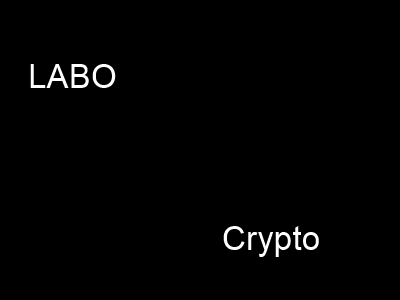

# Labo 4 - Cryptographie

## RC4 / découverte du « keystream »
### Question 2.1
> Donnez le nom de la variable contenant l’état interne, ainsi que son type.

L'état interne est stocké dans la variable `s`, cette dernière est un tableau de type int avec une taille de 256.

### Question 2.2 
> Donnez le nom de la variable contenant la clé secrète, ainsi que son type.

La clé secrète est stocké dans la variable `lpkey`, cette dernière est un pointeur sur char constant (const char*).

### Question 2.3 
> Donnez le bloc de code qui initialise l’état interne.

```
for (a = 0; a < 256; a++) {
     s[a] = a;
}
```

### Question 2.4 
> Donnez le bloc de code qui effectue le mélange de l’état interne en fonction de la clé.

```
for (a = 0; a < 256; a++) {
  c = (c + s[a] + lpKey[a % dwKeyLen]) % 256;
  swap = s[a];
  s[a] = s[c];
  s[c] = swap;
}
```

### Question 2.5
> Donnez le bloc de code qui génère le keystream et effectue le chiffrement ou déchiffrement.

```
a = 0;
c = 0;
for (dwCount = 0; dwCount < dwBufLen; dwCount++) {
  a = (a + 1) % 256;
  c = (c + s[a]) % 256;
  swap = s[a];
  s[a] = s[c];
  s[c] = swap;
  lpBuf[dwCount] ^= s[(s[a] + s[c]) % 256];
}
```

### Question 2.6
> En possédant à la fois un document clair (soit P) et son équivalent chiffré (soit C),
> expliquez comment il est possible de retrouver le keystream (KS) utilisé pour le chiffrement.

En effectuant la différence entre le document clair et son équivalent chiffré, cette dernière correspond à un nombre qu'on a ajouté ou soustrait à notre texte en clair pour le chiffrer.

Ce nombre constitue le keystream.

### Question 2.7
> Si deux fichiers de même taille sont chiffrés avec la même clé, que pouvons-nous dire
> des deux keystream utilisés pour chiffrer ces deux documents ?

Etant donné que les keystreams ont été générés depuis la clé, ils sont identiques.

### Question 2.8
> Quel problème de cette implémentation nous a permis de décrypter cette seconde
> image ? Donnez la formule mathématique qui vous a permis de déchiffrer la 2ème
> image dans la manipulation 2.1.
> Insérez également une copie de l’image montrant le résultat.

Etant donné que les deux images ont été chiffrées avec la même clé RC4, cela signifie que le keystream généré par RC4 pour chiffrer la première image est le même que celui utilisé pour la deuxième.

En effectuant l'opération XOR entre les deux images cryptées, il se possible de récupérer l'image en clair.

Ci-dessous, l'image résultant de cette opération :


### Question 2.9
> Nous avons utilisé le keystream pour déchiffrer la seconde image. Serait-il possible
> d’également retrouver la clé utilisée ? Si oui, décrire comment.

Même en ayant le keystream utilisé, il sera compliqué voire impossible de récupérer la clé, sauf si cette dernière est de mauvaise qualité.

## RC4 / Deux images chiffrées avec la même clé
### Question 3.1
> On peut noter que le keystream utilisé pour le chiffrement des deux images est identique. Avec cette information, que peut-on obtenir comme 
> information sur les images en clair ?

Les images ne seront pas identiques, cependant elles auront des similarités structurelles.

### Question 3.2
> Quel est le texte caché dans ces images ? Insérez également une copie des images superposées.

Le texte caché dans ces images est LABO Crypto.



### Question 3.3
> Cette technique fonctionne-elle efficacement avec n’importe quelles images ou documents ? Pourquoi ?
> Donnez la formule mathématique qui explique ce résultat.

Oui, car le chiffrement est réalisé en effectuant une opération bit à bit entre les données et le keystream.

Cela pourrait être représenter sous cette formule mathématique : 
IMG1_RC4 XOR IMG2_RC4 = (IMG1 XOR KS) XOR (IMG2 XOR KS) = IMG1 XOR IMG2

## AES / Recherche exhaustive de clé
### Question 4.1
> Expliquez succinctement dans quel cadre l’algorithme AES a été conçu et donnez le nom de ses concepteurs.

L'algorithme AES a été conçu dans le cadre du remplacement du DES qui était devenu obsolète en raison de sa clé courte.

Il a été créé par deux cryptographes belges Vincent Rijmen et Joan Daemen.

### Question 4.2
> De nos jours, l’algorithme AES peut-il être encore considéré comme sûr en pratique ?

Oui, de nos jours, il reste l'algorithme le plus utilisé.
Jusqu'à présent, il n'y a pas eu de failles cryptographiques majeures découvertes dans l'algorithme AES lui-même.

### Question 4.3
> Donnez le texte clair et la clé secrète utilisée.

Le texte en clair est le suivant `j aime la crypto`.

La clé secrète utilisée est la suivante `6d6f6e206c61632065737420617a7572`

### Question 4.4 
> Donnez le temps d’exécution de la recherche exhaustive sur votre machine

Le temps d'éxécution a été de 2.07 secondes.

### Question 4.5
> À partir de cette valeur, évaluez le temps nécessaire pour une recherche exhaustive
complète sur les 128 bits de la clé. Justifiez la réponse (explications et calculs).
Vous pouvez donner la réponse sous forme de calcul, en secondes.

Pour 24 bits il nous a fallut 2.07 secondes
si on fait un produit en croix.

2^24 bits = 2.07 s
2^128 bits = x s

x = (2.07 * 2^128) / 2^24
x = 4.19x10^31 secondes

### Question 4.6
> Hormis le temps de calcul, quelle est la principale difficulté/limitation de cette méthode, si on voulait pouvoir déchiffrer n’importe quoi ?

Cela demande un puissance de calcul énorme par ailleurs.
Dans notre test, nous avions l'avantage de connaitre les 4 premières lettres du texte en clair. Cela nous permet de vérifier la clé. On a pas forcément un moyen de vérifier directement.

## Cryptographie appliquée
### Question 5.1
> Dans quel format sont sauvegardées les clés privées ?

Elles sont sauvegardées au format PKCS#8

### Questions 5.2
> Avec quel encodage sont sauvegardées les clés privées ?

C'est au format PEM

### Question 5.3
> Au moment du déchiffrement hybride, 2 clés différentes sont utilisées. Lesquelles et
pour déchiffrer quoi ?

Oui, il y a la clé privée de Bob, afin d'unwrap le message. Ensuite, la clé symétrique est nécessaire pour déchiffrer le message.

### Question 5.4
> Pourquoi utiliser du chiffrement hybride au lieu de n’utiliser que du chiffrement symétrique ou asymétrique ? Donnez 2 avantages.

C'est plus efficace, on gagne en rapidité car on bénéfice de la rapidité du chiffrement symétrique pour les données volumineuses.

La sécurité, on bénéficie des avantages de sécurités du chiffrement asymétrique.

### Question 5.5 
> Donnez un cas où il n’est pas possible d’utiliser l’échange de clé de Diffie-Hellman.
Pourquoi ?

Si on a pas de canal sécurisé pour transmettre les données publics. En effet au départ si un attaquant est au milieu, il pourrait modifier les paramètres d'un élément public.

### Question 5.6
> Avec quelle clé est signée le certificat de Charlie ?

C'est la clé privée de Charlie.

### Question 5.7
> Avec quelle clé est signée le certificat de Alice ?

C'est la clé privée de Charlie.

### Question 5.8
> Quelle clé se trouve dans le certificat de Bob ?

Sa clé publique.
