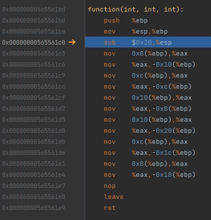

# Labo 5 - Manipulations Mémoire

## Partie 1 : Application de test
### Question 3.1
> Quelle est la valeur de la variable x affichée à la fin du programme principal ?

x = 2

### Question 3.2
> La première incrémentation de x

addl   $0x1,-0xc(%ebp)

0x56556210

### Question 3.3
> La seconde incrémentation de x

addl   $0x1,-0xc(%ebp)

0x56556214

### Question 3.4
> L'appel à l'affichage de la variable x

    sub    $0x8,%esp
	push   $0x56557008
	push   $0x56559040
	call   0xf7d2bc60                 ; <std::basic_ostream<char, std::char_traits<char> >& std::operator<< <std::char_traits<char> >(std::basic_ostream<char, std::char_traits<char> >&, char const*)>
	add    $0x10,%esp
	sub    $0x8,%esp
	push   -0xc(%ebp)
	push   %eax
	call   0xf7d2c140                 ; <std::basic_ostream<char, std::char_traits<char> >::operator<<(int)>
	add    $0x10,%esp
	sub    $0x8,%esp
	push   $0xf7d2b530
	push   %eax
	call   0xf7d2a6d0                 ; <std::basic_ostream<char, std::char_traits<char> >::operator<<(std::basic_ostream<char, std::char_traits<char> >& (*)(std::basic_ostream<char, std::char_traits<char> >&))>
	add    $0x10,%esp

0x56556218 à 0x5655624a

### Question 3.5
> Calculer l'offset entre l'adresse de retour de la fonction function() et le code de la
première incrémentation de x. Détailler le calcul.

En connaissant l'adresse de retour : 0x5655620d

Et l'adresse du addls           : 0x56556210

nous pouvons soustraire 0x56556210 - 0x5655620d = 3

Nous avons un offset de 3.

### Question 3.6
> Calculer l'offset entre l'adresse de retour de la fonction function() et le code de la
seconde incrémentation de x. Détailler le calcul.

En connaissant l'adresse de retour : 0x5655620d

Et l'adresse du 2ème addls        : 0x56556214

nous pouvons soustraire 0x56556210 - 0x5655620d = 6

Nous avons un offset de 6.


### Question 3.7
> Calculer l'offset entre l'adresse de retour de la fonction function() et le code de l'appel
à l'affichage de la variable x. Détailler le calcul.

En connaissant l'adresse de retour : 0x5655620d

Et l'adresse du 2ème addls        : 0x56556218

nous pouvons soustraire 0x56556210 - 0x56556218 = 9

Nous avons un offset de 9.

### Question 3.8
> Fournir une capture du code désassemblé de la fonction function().



### Question 3.9
> Donner la valeur des registres déffinissant la pile, à savoir ESP et EBP (ou RSP et
RBP).


### Question 3.10
> À l'aide du code C++ et assembleur, donner l'adresse de la variable locale "classe",
sachant que cette variable est un pointeur sur un tableau d'entiers.

0xffffd6fc

### Question 3.11
> À partir de ce pointeur sur le tableau  "classe", donner les adresses de classe[0],
classe[1], classe[2], et classe[3].

- classe[0] 0xffffd6fc
- classe[1] 0xffffd700
- classe[2] 0xffffd704
- classe[3] 0xffffd708

### Question 3.12
> À l'aide du code C++ et assembleur, donner l'adresse de la variable locale "grade",
sachant que cette variable est un pointeur sur un tableau d'entiers.

On sait que l'on fait EBP -0x10 pour grade[0] donc c'est 0xffffd70c

### Question 3.13
> À partir de ce pointeur sur le tableau grade, donner les adresses de grade[0],grade[1],
grade[2], et grade[3].

- grade[0] 0xffffd70c
- grade[1] 0xffffd710 (EBP - 0xc)
- grade[2] 0xffffd714 (EBP - 0x8)
- grade[3] 0xffffd718 

### Question 3.14
> À partir des informations précédentes, dessiner la pile (cela inclut les variables locales
"classe" et "grade", la sauvegarde du registre EBP (ou RBP) et la sauvegarde
du registre EIP (ou RIP)). Indiquer aussi par une flèche à quelle adresse pointent
EBP (RBP) et ESP (RSP) respectivement. Représenter la pile juste avant de sortir
de la fonction. Votre représentation de la pile doit comprendre, pour chaque élément
mentionné ci-avant, son adresse, sa description (ex : nom de la variable) et sa valeur

1. 0x00000000ffffd76c 8c 37 e6 f7 <-- ESP (classe[0] = 1)
2. 0x00000000ffffd700 d8 cf ff f7   (classe[1] = 2)
3. 0x00000000ffffd704 28 00 00 00   (classe[2] = 3)
4. 0x00000000ffffd708 00 00 00 00   (classe[3] = indeterminé)
5. 0x00000000ffffd70c 01 00 00 00   (grade[0] = 3)
6. 0x00000000ffffd710 c8 53 a2 f7   (grade[1]= 2)
7. 0x00000000ffffd714 b8 37 e6 f7   (grade[2] = 1)
8. 0x00000000ffffd718 bc 37 e6 f7   (grade[3] =  indeterminé)
9. 0x00000000ffffd71c 48 d7 ff ff <-- EBP


### Question 3.15
> Enlever les commentaires devant l'instruction classe[7] += 10 ; puis expliquer ce
qu'il se passe et pourquoi.

Il va écrire à classe 7. Mais classe 7 n'existe pas donc il fait l'adresse de classe + 7. Donc il arrive sur grade[3] et fait +10.

### Question 3.16
> Modifier grade[1] à partir du tableau "classe". Pour cela, calculer les indices pour
tomber juste ! Indiquer la ligne à ajouter juste avant l'instruction modifiée précédemment et prouver, à l'aide d'une capture d'écran de la représentation de la mémoire, que
la mémoire a bien été changée comme souhaité. Commenter et expliquer le phénomène.

```c++
classe[5] = 5;
```
Il va écrire à classe 5. Mais classe 5 n'existe pas donc il fait l'adresse de classe + 5. Donc il arrive sur grade[1] et met la variable à 5.

### Question 3.17
> Modifier cette instruction pour effectuer un stack overflow et pour que le programme
affiche x=1. Justifier en indiquant la valeur de saut d'adresse, la méthode employée et
l'instruction C++ qui remplace le code précédent

```c++
classe[16] = -1;
```

0xffffd6fc <-- adresse de classe[0]

0xffffd73c <-- adresse de x

Nous devons nous déplacer de 16 adresses en avant.

La méthode utilisée et d'aller écrire à une adresse qui n'est plus dans le tableau et qui provoque un overflow. 

### Question 3.18
> Quelle est la valeur d'EIP/RIP stockée en mémoire avant la dernière instruction de
la fonction ? Quelle est sa valeur après la dernière instruction (juste avant de sortir de
la fonction) ? Illustrer la réponse avec deux captures d'écran représentant la mémoire
avant et après la modification de la valeur EIP.

Dans la mèmoire nous ne constatons pas de différentes avec l'adresse EIP sauvegardée qui correspond à l'adresse de retour de la fonction. La valeur dans la mèmoire est "1d 65 55 56".

Cependant dans le registre EIP elle est bien modifiée car nous avons excécuté une ligne ou plusieur du code assembleur.

- EIP avant éxecution : 0x565561f0
- EIP après éxecution : 0x565561f7


### Question 3.19
> Comment modifier le stack overflow pour afficher x=0 ? Justifier en indiquant la
valeur de saut d'adresse, la méthode employée et l'instruction C++.

```c++
classe[16] = -2;
```

0xffffd6fc <-- adresse de classe[0]

0xffffd73c <-- adresse de x

Nous faisons classe[16] ce qui nous fait arriver directement sur x et nous écrivons à cette adresse.


## Partie  2 : feuille-caillou-ciseaux

### Question 4.1
> Indiquer comment utiliser la faille fonctionnelle permettant de gagner à tous les coups.
Illustrer la réussite par une capture d'écran du programme.

Si on prend l'ID 0 on gagne à chaque fois.


### Question 4.2
> Expliquer, au niveau du code, comment cette attaque fonctionne. Décrire les modifi-
cations à apporter au programme pour fixer cette faille.

À la ligne 11 nous mettons l'id afin d'indiquer le vote du joueur. Cependant le tableau vote est initialisé à 0. Donc lorsque l'on met l'id dedans il rajoute 0. Cela engendre que nous ne passons jamais dans le if à la ligne 26.

À la ligne 75 nous devons mettre
```c++
	while ( !(( cin >> id) && id > 0 && id <= 1000))
```

### Question 4.3
> Représenter la pile de la fonction evalue_fcc() lorsque toutes les variables locales
sont déclarées a
. Cette étape est importante car elle vous permet de savoir comment
la pile est organisée (en 32 ou 64 bits) et cela vous aidera grandement pour réaliser le
"stack overflow".
a. Utiliser la même représentation de la pile et les mêmes éléments que demandés à la question


- 0xffffd6e0 <-- ESP ()(ordi[0])
- 0xffffd6e4 (ordi[1])
- 0xffffd6e8 (ordi[2])
- 0xffffd6ec (vote[0])
- 0xffffd6f0 (vote[1])
- 0xffffd6f4 (vote[2])
- 0xffffd6f8 (alea)
- 0xffffd6fc (i)
- 0xffffd700 (i)
- 0xffffd704 (i)
- 0xffffd708 <-- EBP
- 0xffffd70c <-- ancien EIP donc adresse de retour


### Question 4.4
> Chercher un moyen de modifier la pile. Étant donné que le joueur n'a que peu d'entrées
possibles (identifiant, choix feuille-caillou-ciseaux), cela ne doit pas être compliqué.
Quel paramètre permet de modifier la pile ? Quelle valeur faut il lui donner pour
atteindre la valeur sauvegardée d'EIP/RIP ?

C'est au niveau du choix feuille-caillou-ciseaux que nous effectuons l'overflow.

il faut choisir 8 pour arriver sur l'adresse EIP.

### Question 4.5
> Grâce à la question précédente, il est donc possible de modifier l'adresse de retour.
Quel paramètre contrôle l'incrément de la valeur d'EIP/RIP ?

C'est l'id car on fait 
```c++
	vote[in]+= id;
```

### Question 4.6
> Donner la logique de l'attaque (par rapport au code C++). Quelles instructions devraient être sautées ?

il faudrait sauter les instructions ou on analyse le score et on rajoute un point ou non.

```c++
	if (res != 0 || vote < 0 || vote > 2)
            score++;
```

### Question 4.7
> Quelle serait la valeur de l'incrément d'EIP/RIP permettant de gagner ? Justifier la
réponse.

Nous devons modifier l'adresse de retour qui est actuellement : 0x56556681
l'adresse de retour souhaitée : 0x5655669e

donc 0x5655669e - 0x56556681 = 29

### Question 4.8
> L'attaque ayant été analysée, il reste à la réaliser. Fournir une capture d'écran prouvant
"la triche" (en ayant le score de 0 à la fin). Le déroulement du programme ainsi que
le message de bienvenue au score final doivent bien évidemment y figurer.


