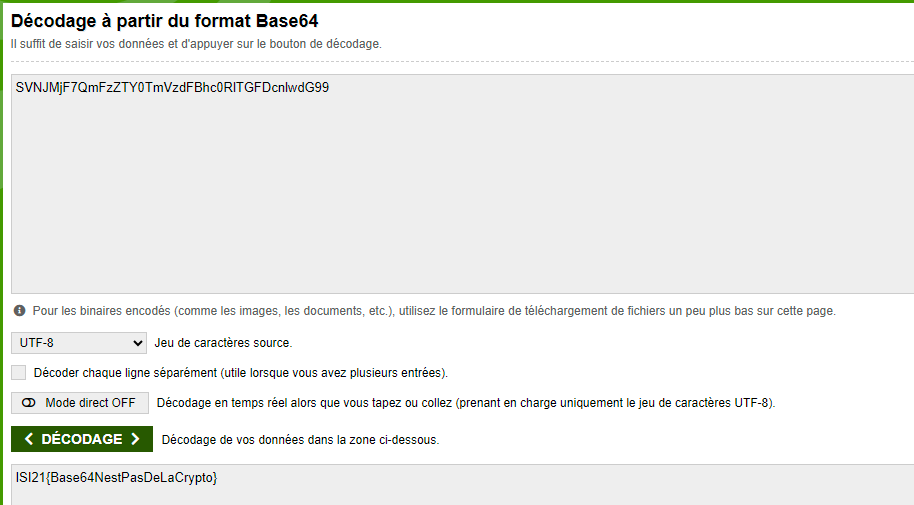

# ISI-CTF-2024 – 64 jours après et toujours pas déchiffré...

* **Auteurs:** 
	* Vasques Dario
	* Mariaux Ewan
	* Pollien Lionel
	* Lopes Dos Santos Rodrigo
* **Categorie:** choix : Misc
* **Points:** 100

## Challenge

**URL du challenge :** http://10.190.133.43/challenges#64%20jours%20apr%C3%A8s%20et%20toujours%20pas%20d%C3%A9chiffr%C3%A9...-10

**Texte d'introduction du challenge :**

> Un ami vous envoie un fichier qui contient un texte important... Malheureusement, il n'arrive pas à le déchiffrer... Ça fait 64 jours qu'il essaie et il n'a toujours pas de solution... Et même "42"... la réponse à tout dans l'univers n'a pas pu l'aider.

**Hints :** (si utilisés)

- Hint 1
- Hint 2

## Tentatives

1. Dans le titre il y avait 64 alors j'ai essayer de décoder depuis la BASE64

## Solution finale

Dans le titre du challenge il y avait 64.
J'ai donc essayer de décoder du BASE64.

J'ai utilisé le site :
[Base 64 Decode](https://www.base64decode.org/fr/)

Voici le résultat :

## Flag

Le flag était : 
> FLAG = ISI21{Base64NestPasDeLaCrypto}

## Mitigations possibles
La mitigation suivante est envisageable :

- Ne pas utiliser BASE64 pour chiffrer quelque chose.

