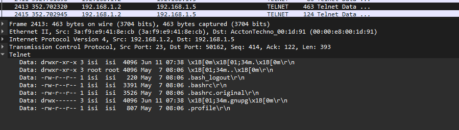

# ISI-CTF-2024 – Scharcking

* **Auteurs:** 
	* Vasques Dario
	* Mariaux Ewan
	* Pollien Lionel
	* Lopes Dos Santos Rodrigo
* **Categorie:** choix : forensic
* **Points:** 100


## Challenge

**URL du challenge :** http://10.190.133.43/challenges#Sharkcking-11

**Texte d'introduction du challenge :**

> Quelqu'un a piraté une machine Kali sur votre réseau. Vous avez réussi à sniffer les paquets pendant l'attaque. Trouvez le mot de passe qui a été utilisé pour se connecter à cette > > machine Kali (N'oubliez pas de le mettre entre crochets).

**Hints :** (si utilisés)

- Hint 1
- Hint 2


## Tentatives

1. J'ai d'abord chercher dans le trame SSH aux alentours des échanges de clé.
2. Chercher dans les trames TELNET. 


## Solution finale

Filtrer sur "telnet" dans wireshark.
Trouver une trame qui dit : "Data: Password:"

Ensuite l'ensemble des caractères sont dans des trames séparées.
Lorsque nous avons "\r\n" cela veut dire que nous sommes à la fin du mot de passe.

Nous avons la confirmation  que l'utlisateur est connecté car dans la suite des trames il fait
```shell
ls --aal
```



## Flag

Le flag était : 
> FLAG = ISI22{4ws0mePc4pfl4g}


## Mitigations possibles
La mitigation suivante est envisageable :

- bloquer la connexion telnet à la machine Kali


